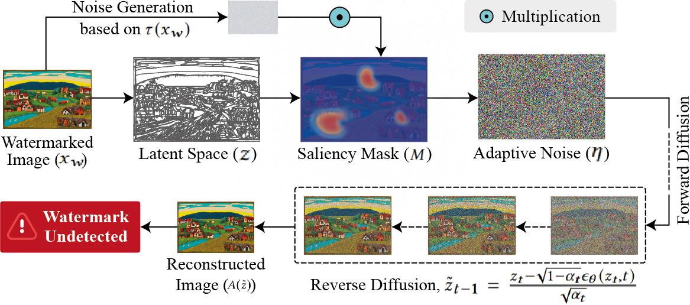

<h4 align="center"><strong><a href="https://www2025.thewebconf.org/short-papers">Accepted by ACM Web Conference 2025 (WWW Companion 2025), Sydney, Australia</a></strong></h4>
<h2 align="center"><strong>Saliency-Aware Diffusion Reconstruction for Effective Invisible Watermark Removal<a href="https://github.com/inzamamulDU/SADRE/blob/main/assets/SADRE_Paper.pdf" target="_blank">[Paper]</a></strong></h2>
<h6 align="center">Inzamamul Aalm<sup></sup>, Md Tanvir Islam<sup></sup>, Simon S. Woo<sup>*</sup></h6>
<h6 align="center">| Department of Computer Science and Engineering, Sungkyunkwan University, South Korea | *Corresponding Author |</h6> 
<hr>



### Dependencies
```
pip install -r requirements.txt
````
## We use CUDA 11.3 for our experiment.
### Run the attack
```
python run.py
````


## Cite this Paper

If you find our work useful in your research, please consider citing our paper:

```bibtex
@inproceedings{sadre_www_2025,
  title={Saliency-Aware Diffusion Reconstruction for Effective Invisible Watermark Removal},
  author={Alam, Inzamamul and Islam, Md Tanvir and Woo, Simon S.},
  booktitle={Companion Proceedings of the ACM Web Conference 2025 (WWW Companion’25)},
  year={2025},
  doi= {https://doi.org/10.1145/3701716.3715519}
}
```

Part of this project is based on [WatermarkAttacker](https://github.com/XuandongZhao/WatermarkAttacker).

 <p xmlns:cc="http://creativecommons.org/ns#" xmlns:dct="http://purl.org/dc/terms/"><a property="dct:title" rel="cc:attributionURL" href="http://10.1145/3701716.3715519">Saliency-Aware Diffusion Reconstruction for Effective Invisible Watermark Removal</a> by <a rel="cc:attributionURL dct:creator" property="cc:attributionName" href="https://github.com/inzamamulDU/SADRE">Inzamamul Alam, Md Tanvir Islam, & Simon S. Woo</a> is licensed under <a href="https://creativecommons.org/licenses/by-sa/4.0/?ref=chooser-v1" target="_blank" rel="license noopener noreferrer" style="display:inline-block;">CC BY-SA 4.0</a></p> 
